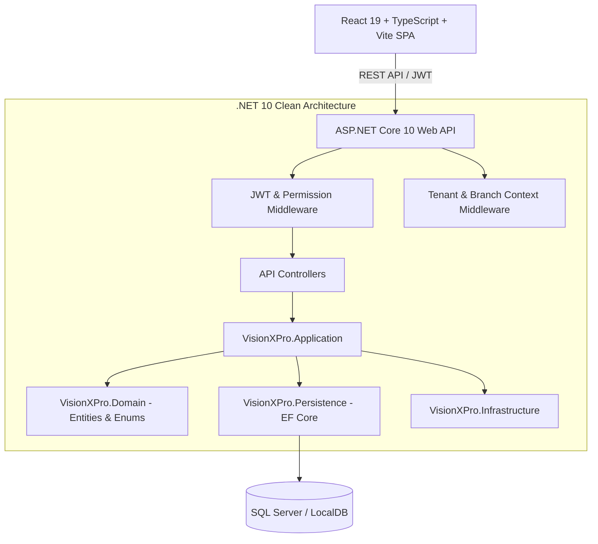

# 👓 VisionXPro - Next-Generation Optical Store & Multi-Branch SaaS Management System

<div align="center">


[](https://dotnet.microsoft.com/)
[](https://dotnet.microsoft.com/)
[](https://react.dev/)
[](https://www.typescriptlang.org/)
[](https://vitejs.dev/)
[](https://tailwindcss.com/)
[](https://learn.microsoft.com/ef/core/)
[](#)

<p align="center">
  <b>Modern optisyenlik müesseseleri, çok şubeli optik zincirleri ve bağımsız optik mağazaları için uçtan uca dijital dönüşüm platformu.</b>
  <br />
  <i>Hızlı Satış (POS) • Reçete ve Optik Sipariş • SGK Medula & ÜTS Hazırlık Kuyruğu • Şubeler Arası Transfer • Termal Barkod/QR Baskı • Müşteri CRM</i>
</p>

</div>

---

## 📑 İçindekiler
- [Proje Hakkında](#-proje-hakkında)
- [Öne Çıkan Özellikler](#-öne-çıkan-özellikler)
- [Sistem Mimarisi](#-sistem-mimarisi)
- [Kullanıcı Rolleri ve Yetki Matrisi](#-kullanıcı-rolleri-ve-yetki-matrisi)
- [Teknoloji Yığını](#-teknoloji-yığını)
- [Dizin Yapısı](#-dizin-yapısı)
- [Kurulum ve Çalıştırma](#-kurulum-ve-çalıştırma)
- [Varsayılan Kullanıcılar](#-varsayılan-kullanıcılar)
- [Yol Haritası (Roadmap)](#-yol-haritası-roadmap)

---

## 💡 Proje Hakkında

**VisionXPro**, optik sektöründeki karmaşık süreçleri (cam dioptrileri, silindirik/aks değerleri, pupilla mesafeleri, SGK Medula optik reçete entegrasyonu, T.C. Sağlık Bakanlığı Ürün Takip Sistemi - ÜTS bildirimleri ve şubeler arası stok yönetimi) tek çatı altında toplayan, kurumsal standartlarda geliştirilmiş çok kiracılı (**Multi-Tenant**) bir ERP ve Satış Yönetim Platformudur.

Geleneksel, hantal masaüstü optik yazılımlarının aksine; modern web teknolojileri, responsive arayüz, bulut tabanlı mimari ve gerçek zamanlı şube senkronizasyonu sunar.

---

## 🚀 Öne Çıkan Özellikler

### 1. 🛒 Akıllı Optik Satış Noktası (POS)
* **Hızlı Barkod Okutma:** USB ve kablosuz barkod okuyucularla tam uyumlu ürün arama ve sepete ekleme.
* **Esnek Ödeme Yöntemleri:** Nakit, Kredi Kartı, Parçalı Tahsilat ve Açık Hesap (Veresiye/Cari) yönetimi.
* **SGK Katkı Payı & İskonto:** Reçeteli satışlarda SGK hak ediş tutarını sepetten düşme ve anında net müşteri ödemesi hesaplama.
* **Fiş & Bilgi Fişi Yazdırma:** Termal fiş yazıcıları için optimize edilmiş satış bilgi fişi çıktısı.

### 2. 🔬 Optik Sipariş & Reçete Yönetimi
* **Kapsamlı Reçete Parametreleri:** Sağ/Sol göz için SPH (Sferik), CYL (Silindirik), AXIS (Aks), PD (Pupilla Mesafesi) ve Addition değerleri.
* **Cam ve Çerçeve Detaylandırma:** Tek Odaklı, Progresif, Bifokal cam seçenekleri; Mavi Işık, UV400, Antirefle, Fotokromik (Colormatic) kaplama filtreleri.
* **Montaj ve Atölye Durumu Takibi:** *Beklemede*, *Atölyede/Montajda*, *Hazır*, *Teslim Edildi* adımlarıyla canlı süreç yönetimi.

### 3. 🛡️ SGK Medula & ÜTS (Ürün Takip Sistemi) Uyumluluğu
* **Tıbbi Cihaz Bildirim Kuyruğu:** Satışı yapılan çerçeve ve camların ÜTS tekil bildirimlerini ve Medula reçete kayıtlarını yöneten arka plan kuyruğu.
* **GLN & Tesis Kodu Yapılandırması:** Şube bazlı GLN (Küresel Lokasyon Numarası) ve Medula Tesis Kodu yönetimi.

### 4. 👥 Müşteri & Hasta CRM
* Müşteri geçmişi, geçmiş reçeteler, alınan gözlükler ve kalan bakiye dökümü.
* **Müşteri Segmentasyonu:** VIP, Standart ve Özel Müşteri grupları.
* Doğum günü, lens yenileme ve kontrol randevusu hatırlatmaları için SMS şablon entegrasyonu.

### 5. 🏷️ Envanter & Termal Etiket / Barkod / QR Baskısı
* Çerçeve ve optik camlar için özel termal kelebek etiket şablonları.
* Otomatik EAN-13 / Code128 barkod ve dinamik QR kod üretimi.
* Kritik stok seviyesi uyarıları ve kategori/marka bazlı filtreleme.

### 6. 🏢 Çok Şubeli Zincir (Corporate) Yönetimi
* Tek bir merkezden bağlı tüm şubeleri, kasaları ve stokları izleme.
* **Şubeler Arası Transfer:** Şubeler arasında stok transfer talebi açma, onaylama ve otomatik stok mutabakatı.

### 7. 📊 Finans & Kasa Yönetimi
* Günlük ciro, tahsilat dağılımı (Nakit, POS, Havale/EFT).
* **Z-Raporu:** Gün sonu kasa kapatma ve detaylı mutabakat raporları.
* Masraf ve gelir/gider kalemlerinin şube bazlı takibi.

### 8. 🌐 Halka Açık Portalı & E-Ticaret Vitrini
* Mağaza bulucu (İl/İlçe bazlı optik şubeleri).
* Çerçeve ve güneş gözlüğü online ürün vitrini.
* Müşteriler için online randevu oluşturma akışı.

---

## 🏗️ Sistem Mimarisi



---

## 🔐 Kullanıcı Rolleri ve Yetki Matrisi

| Rol | Kapsam | Yetkiler |
| :--- | :--- | :--- |
| **SuperAdmin** | Sistem Geneli | Tüm organizasyonlar, SaaS abonelik planları, sistem logları, küresel ayarlar. |
| **CorporateOwner** | Şirket / Zincir | Tüm bağlı şubeler, şubeler arası transferler, konsolide finansal raporlar. |
| **ShopOwner** | Tek Şube | Şube kasası, envanter, reçeteler, personel izinleri, şube ayarları, POS. |
| **ShopStaff** | Şube Personeli | Kendisine atanan yetkilere göre (Satış, Reçete, Stok, Randevu vb.). |
| **Customer** | Son Kullanıcı | Kendi reçeteleri, sipariş durumu, online randevular. |

---

## 🛠️ Teknoloji Yığını

### Backend
* **Çatı:** .NET 10.0 (C#)
* **Mimari:** Clean Architecture (Domain, Application, Infrastructure, Persistence, API)
* **ORM:** Entity Framework Core 10.0
* **Veritabanı:** Microsoft SQL Server / LocalDB (PostgreSQL & SQLite kolayca entegre edilebilir)
* **Güvenlik:** JWT (JSON Web Tokens), BCrypt / ASP.NET Identity Password Hashing, Rol ve Claim bazlı yetkilendirme
* **Dokümantasyon:** Swagger / OpenAPI

### Frontend
* **Kütüphane:** React 19 + TypeScript
* **Derleyici & Paketleyici:** Vite 8
* **Stil & Tasarım:** Tailwind CSS v4 + Framer Motion (Mikro-etkileşimler & animasyonlar)
* **İkonlar:** Lucide React
* **Durum Yönetimi:** Zustand
* **Grafikler:** Recharts
* **Barkod / QR:** `react-barcode`, `qrcode.react`
* **Bildirimler:** React Hot Toast

---

## 📂 Dizin Yapısı

```
VisionXPro/
├── VisionXPro.Backend/
│   ├── VisionXPro.Api/            # ASP.NET Core Web API (Controllers, Middlewares)
│   ├── VisionXPro.Application/    # DTOs, Arayüzler, İş Mantığı, İzin Tanımları
│   ├── VisionXPro.Domain/         # Varlıklar (Entities), Değer Nesneleri
│   ├── VisionXPro.Infrastructure/ # JWT Sağlayıcı, Harici Servisler
│   ├── VisionXPro.Persistence/    # AppDbContext, EF Core Migrations
│   └── VisionXPro.slnx            # .NET Solution Dosyası
│
├── vision-x-pro-frontend/
│   ├── src/
│   │   ├── components/            # Yeniden kullanılabilir UI bileşenleri
│   │   ├── pages/
│   │   │   ├── Admin/             # Süper Admin Yönetim Paneli
│   │   │   ├── Corporate/         # Zincir Mağaza & Merkez Paneli
│   │   │   ├── Shop/              # Optik Dükkan İşletim Paneli (POS, Reçete, Kasa)
│   │   │   └── Public/            # Halka Açık Vitrin & Randevu Portalı
│   │   ├── store/                 # Zustand durum depoları (auth vb.)
│   │   ├── lib/                   # API istemcisi ve yapılandırmalar
│   │   └── utils/                 # Şehir/İlçe listeleri, CSV dışa aktarım, izinler
│   ├── package.json
│   └── vite.config.ts
│
├── .gitignore                     # Kapsamlı Git ignore kuralları (.NET, Node, Dist)
└── README.md                      # Proje tanıtım ve kılavuz dökümanı
```

---

## ⚡ Kurulum ve Çalıştırma

### Gereksinimler
- [.NET 10 SDK](https://dotnet.microsoft.com/download/dotnet/10.0) veya üzeri
- [Node.js](https://nodejs.org/) (v18 veya üzeri) & npm
- [SQL Server](https://www.microsoft.com/sql-server) veya LocalDB (Visual Studio ile birlikte gelir)

### 1. Backend Kurulumu

```bash
# Backend dizinine geçin
cd VisionXPro.Backend

# Bağımlılıkları yükleyin ve derleyin
dotnet restore
dotnet build

# Veritabanını oluşturun ve migration'ları uygulayın
dotnet ef database update --project VisionXPro.Persistence --startup-project VisionXPro.Api

# API'yi başlatın (Varsayılan port: http://localhost:5069 veya https://localhost:7069)
dotnet run --project VisionXPro.Api
```

API başladığında Swagger arayüzüne `http://localhost:5069/swagger` adresinden erişebilirsiniz.

### 2. Frontend Kurulumu

```bash
# Frontend dizinine geçin
cd vision-x-pro-frontend

# Paketleri yükleyin
npm install

# Geliştirme sunucusunu başlatın
npm run dev
```

Uygulama varsayılan olarak `http://localhost:5173` adresinde açılacaktır.

---

## 🔑 Varsayılan Kullanıcılar (Tohum Veri)

Veritabanı ilk başlatıldığında otomatik olarak şu yönetici hesabı oluşturulur:

| E-Posta | Parola | Rol |
| :--- | :--- | :--- |
| `admin@visionxpro.com` | `Admin123!` | SuperAdmin |

> Yeni bir optik mağazası oluşturmak için `SuperAdmin` hesabıyla giriş yapıp **Organizasyonlar** menüsünden yeni bir mağaza ve `ShopOwner` kullanıcısı tanımlayabilirsiniz.

---

## 🗺️ Yol Haritası (Roadmap)

- [x] Çok Kiracılı Mimari ve Organizasyon Yönetimi
- [x] Optik Satış Noktası (POS) ve Barkod Desteği
- [x] Reçete (SPH, CYL, AXIS, PD, ADD) Takibi
- [x] Şubeler Arası Envanter Transferi
- [x] Termal Etiket ve Barkod/QR Baskısı
- [x] Halka Açık Mağaza Bulucu ve Vitrin
- [ ] **Medula Optik Canlı Web Servis Entegrasyonu:** T.C. Kimlik ve e-Reçete No ile SGK'dan otomatik reçete sorgulama.
- [ ] **ÜTS Canlı Entegrasyonu:** Tekil bildirim, verme ve alma bildirimlerinin e-İmza / Sistem Token ile otomatik iletilmesi.
- [ ] **Cam Üreticileri Fiyat Listesi Entegrasyonu:** Hoya, Zeiss, Essilor, Novax vb. cam kataloglarının Excel/API ile içeri aktarılması.
- [ ] **AI Destekli Dijital Pupillometre:** Müşterinin kamera görüntüsü üzerinden PD ve montaj yüksekliği tespiti.
- [ ] **WhatsApp & SMS Otomasyonu:** Netgsm / Twilio / İletiMerkezi üzerinden otomatik "Gözlüğünüz Hazır" ve bakım hatırlatma mesajları.
- [ ] **Mobil Uygulama (React Native / PWA):** Sahada ve optisyen masasında tablet kullanımına özel dokunmatik mod.

---

## 📄 Lisans
Bu proje özel mülkiyet ve ticari kullanım amacıyla geliştirilmiştir. Tüm hakları saklıdır.
